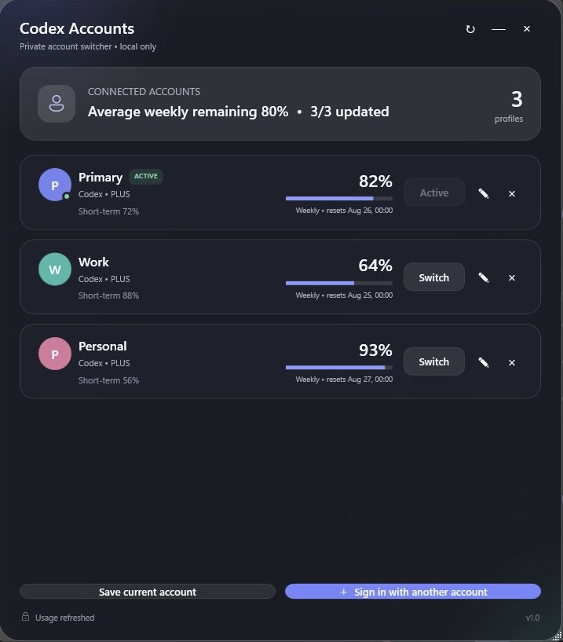

# Unofficial Codex Account Switcher for Windows

[](https://github.com/aleknagvidas-hue/Codex-Account-Switcher/actions/workflows/build.yml)
[](LICENSE)
[](https://www.microsoft.com/windows)

A privacy-conscious Windows desktop utility for saving multiple local Codex sign-in sessions under private labels and manually switching the installed Codex desktop app between them.

> [!IMPORTANT]
> This is an independent community project. It is not affiliated with, endorsed by, or supported by OpenAI. Use it only with accounts that you own and control. It is not designed to share credentials, pool subscriptions, automate account rotation, or circumvent usage limits.

## Screenshot



The screenshot uses synthetic labels, usage percentages, and reset times. It contains no real account identifiers, email addresses, or credentials.

## Why this project exists

The Codex desktop app uses one active local authentication state at a time. If you legitimately maintain more than one personal account, repeatedly signing out and completing full authentication can be disruptive. This tool keeps encrypted local copies of sessions you explicitly add and performs a deliberate, user-confirmed switch on this Windows PC.

It does **not** keep multiple accounts active in one Codex window. It does **not** call "log out all devices." Each switch closes Codex, atomically replaces the local active authentication file, and starts Codex again.

## Features

- Save the current Codex session under a label you choose
- Add another account through an isolated browser sign-in flow
- Switch accounts manually after an explicit confirmation
- Encrypt saved credential payloads with Windows DPAPI
- Keep account labels private instead of displaying email addresses or service usernames
- Show short-term and weekly usage windows when the installed Codex App Server returns them
- Preserve a local backup during atomic authentication replacement
- Stop only the packaged `OpenAI.Codex_*` desktop process tree
- Build from source with one double-click
- No telemetry, analytics, advertising, or project-owned backend

## Requirements

- Windows 10 or Windows 11, x64
- The Windows Codex desktop app installed and signed in
- [.NET 8 SDK](https://dotnet.microsoft.com/download/dotnet/8.0) to build from source

Visual Studio is optional. The .NET SDK is sufficient.

## Quick start

1. Download or clone this repository.
2. Double-click [`BUILD_RELEASE.cmd`](BUILD_RELEASE.cmd).
3. Wait for the build to complete.
4. Run:

   ```text
   artifacts\win-x64\CodexAccountSwitcher.exe
   ```

The first build may need internet access to restore .NET packages.

### Clone with Git

```powershell
git clone https://github.com/Chisiki1/codex-account-switcher-windows.git
cd codex-account-switcher-windows
.\BUILD_RELEASE.cmd --no-pause
```

### Build manually

```powershell
dotnet publish .\src\CodexAccountSwitcher\CodexAccountSwitcher.csproj `
  -c Release `
  -r win-x64 `
  --self-contained false `
  -p:PublishSingleFile=true `
  -p:DebugType=None `
  -p:DebugSymbols=false `
  -o .\artifacts\win-x64
```

The output is framework-dependent. A machine that only runs the resulting executable needs the .NET 8 Desktop Runtime.

## Usage

### Save the current account

1. Open Codex and make sure it is signed in to the account you want to save.
2. Start Codex Account Switcher.
3. Select **Save current account**.
4. Enter a private label and choose a color.

Labels are never derived from the authentication payload. You do not need to enter an email address or OpenAI username.

### Add another account

1. Select **Sign in with another account**.
2. Enter a private label and choose a color.
3. Complete sign-in in the browser window that opens.

The login runs in a temporary isolated `CODEX_HOME`. Adding an account does not change the account currently active in the open Codex window.

If the browser automatically selects the existing account, open the sign-in URL in an InPrivate/incognito window or a separate browser profile.

### Switch accounts

1. Finish or save work in Codex.
2. Select **Switch** on the target account.
3. Review the confirmation and continue.

Codex closes and restarts once. The tool does not request an account-wide logout, and it does not intentionally affect sessions on other devices.

### Refresh usage information

Use the refresh button to request available rate-limit windows from the installed Codex App Server. Depending on the account and current Codex behavior, the response may contain:

- A short-term remaining percentage and reset time
- A weekly remaining percentage and reset time
- A plan type

An unavailable usage response never blocks manual account switching.

## Security model

Saved credential payloads are encrypted with Windows Data Protection API (DPAPI) and additional application entropy. The encrypted files are intended to be recoverable only by the same Windows user profile on the same security context.

Runtime data is stored under:

```text
%LOCALAPPDATA%\CodexAccountSwitcher
```

| Data | Storage | Protection |
| --- | --- | --- |
| Saved authentication payloads | `profiles\*.auth.dpapi` | Windows DPAPI |
| Labels, colors, usage cache | `profiles.json` | Plain JSON; no tokens or email addresses |
| Active Codex authentication | `%USERPROFILE%\.codex\auth.json` | Managed in the format required by Codex |
| Switch backup | `%USERPROFILE%\.codex\auth.json.codex-switcher.bak` | Local rollback copy |

The active Codex `auth.json` and rollback copy are **not** re-encrypted by this application because Codex must read its normal authentication format. Rely on Windows account isolation and full-disk protection for those files.

DPAPI does not protect against malware running as the same Windows user, an administrator, or a fully compromised machine. See [SECURITY.md](SECURITY.md) and [PRIVACY.md](PRIVACY.md) before use.

## Design safeguards

- Authentication files are validated before they are stored or activated.
- Duplicate accounts are rejected by a stable account fingerprint.
- Replacement uses a same-directory temporary file and atomic move/replace behavior.
- The departing account's refreshed credential state is saved before switching.
- Codex shutdown is verified across consecutive process scans before authentication changes.
- Unidentified `ChatGPT.exe` processes cause the switch to fail closed.
- Temporary isolated login directories are deleted only after a path-boundary check.
- Tokens, authentication JSON, account IDs, and email addresses are never written to application logs.

For a deeper technical description, see [Architecture](docs/ARCHITECTURE.md).

## Known limitations

- This project depends on behavior exposed by the installed Codex desktop package and App Server. Those interfaces may change without notice.
- Saved sessions can expire or be revoked, requiring a new sign-in.
- Usage windows are best-effort and may be unavailable or change format.
- This is manual switching, not concurrent multi-account operation.
- The project does not provide account sharing, subscription pooling, or automatic limit-based routing.
- Local builds are unsigned unless you sign them yourself.

## Troubleshooting

### `dotnet` is not found

Install the **.NET 8 SDK**, open a new terminal, and run `BUILD_RELEASE.cmd` again. The Desktop Runtime alone cannot compile the source.

### The Codex App Server executable is not found

Install or update the Windows Codex desktop app, launch it once, and retry.

### Codex cannot be closed or keeps restarting

Wait a few seconds and retry. If the message persists, close Codex manually and confirm that no unrelated `ChatGPT.exe` process is running before switching.

### Weekly usage is unavailable

The account or current App Server response may not expose a weekly window. Account switching remains available.

### A saved account no longer works

The session may have expired or been revoked. Delete the local profile and add the account again through the browser sign-in flow.

## Testing

Run the deterministic regression suite:

```powershell
dotnet run --project .\tests\CodexAccountSwitcher.Tests\CodexAccountSwitcher.Tests.csproj -c Release
```

Include read-only integration checks for an installed Codex App Server and desktop process:

```powershell
dotnet run --project .\tests\CodexAccountSwitcher.Tests\CodexAccountSwitcher.Tests.csproj -c Release -- --integration
```

The integration option does not perform a real account switch.

## Project layout

```text
BUILD_RELEASE.cmd                         One-click Windows build
src\CodexAccountSwitcher                 WPF application
tests\CodexAccountSwitcher.Tests         Regression and integration harness
docs\ARCHITECTURE.md                     Architecture and trust boundaries
.github\workflows\build.yml              Public CI build
```

## Contributing

Bug reports and focused pull requests are welcome. Please read [CONTRIBUTING.md](CONTRIBUTING.md) and the [Code of Conduct](CODE_OF_CONDUCT.md) first. Do not post tokens, authentication files, account identifiers, email addresses, or unredacted logs in public issues.

## License

Released under the [MIT License](LICENSE).
